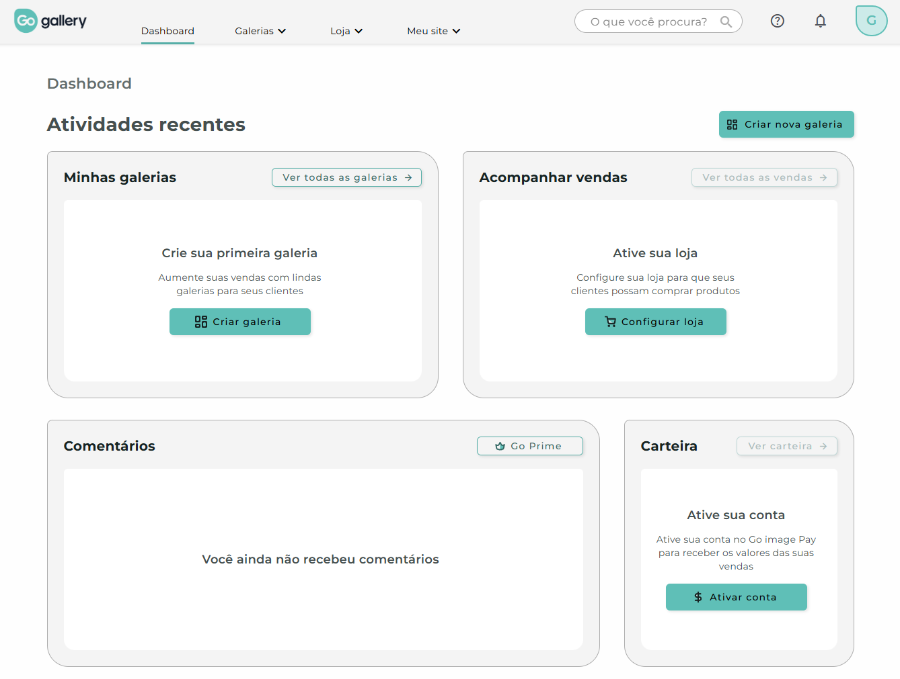
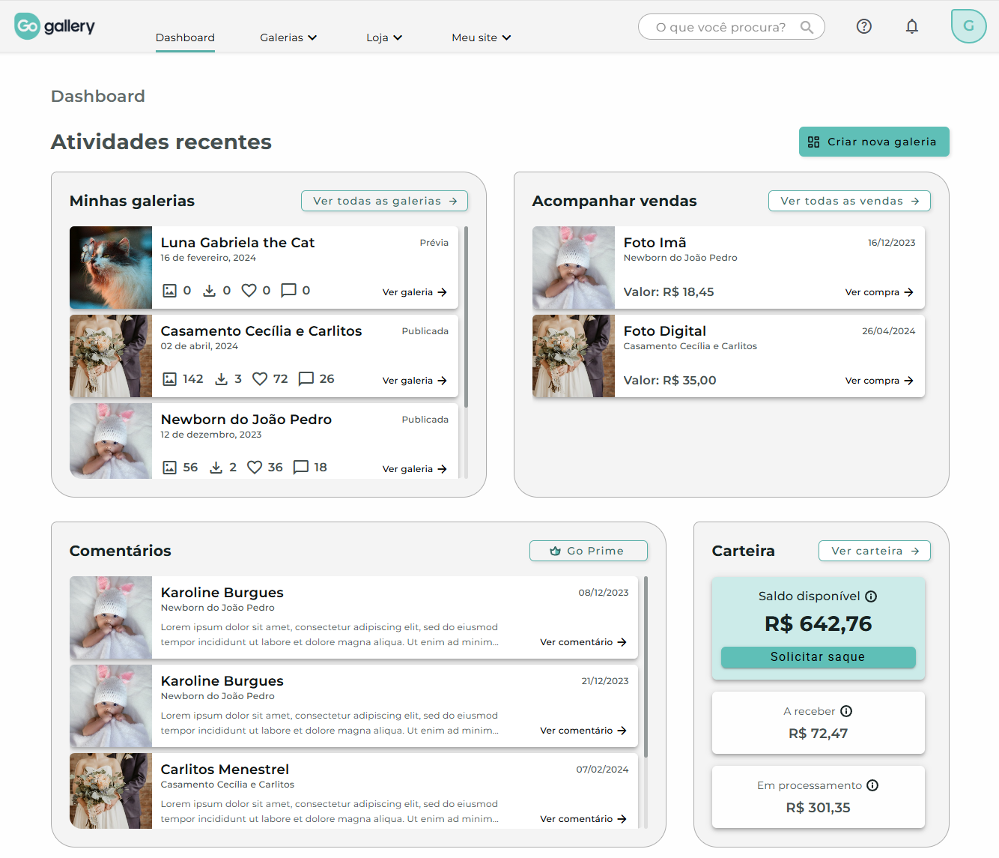
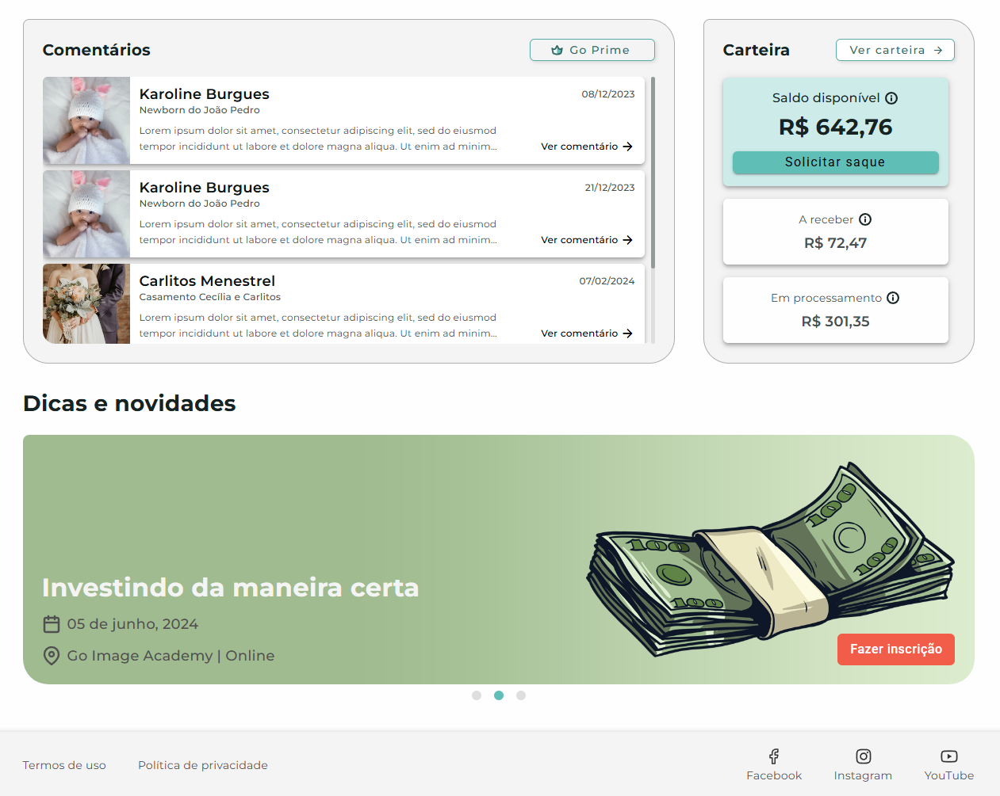

# gallery-ui-preview-web

**gallery-ui-preview-web** is an Angular-based web application created as a static UI preview for **[Go gallery](https://www.goimage.com.br/go-gallery/about)**, a platform focused on building a complete digital ecosystem for photographers and related-area professionals.

This project was originally developed as a technical and design evaluation to demonstrate my ability to follow stakeholder design requests, understand the proposed product flow, and translate business expectations into a functional front-end experience. After completing this test project, I was later hired to work on the original Go gallery project.

## Features

- Static Angular-based UI preview.
- Interface based on stakeholder-provided design direction.
- Gallery-focused visual experience.
- User flow simulation for photography-related workflows.
- Responsive layout structure.
- Clean front-end organization for presentation and evaluation purposes.

## Preview

Below are some screenshots from the UI preview created for Go gallery.

| Empty state | Filled state | Carousel preview |
|---|---|---|
|  |  |  |

## Project status

This project is no longer receiving updates. It remains available for reference, but no new features, optimizations, or UI enhancements are planned.

## Developers

Gregory Perozzo.

## License

Copyright (c) Gregory Perozzo. All rights reserved.

This project is publicly available for portfolio and reference purposes only.

See the [LICENSE](./LICENSE) file for details.
